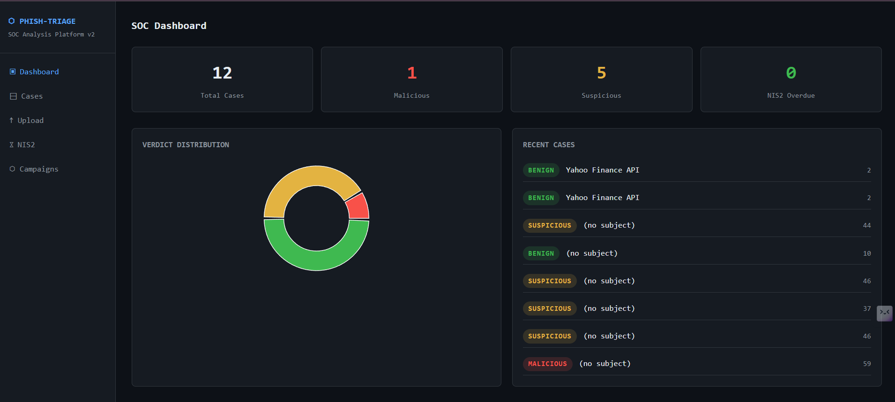
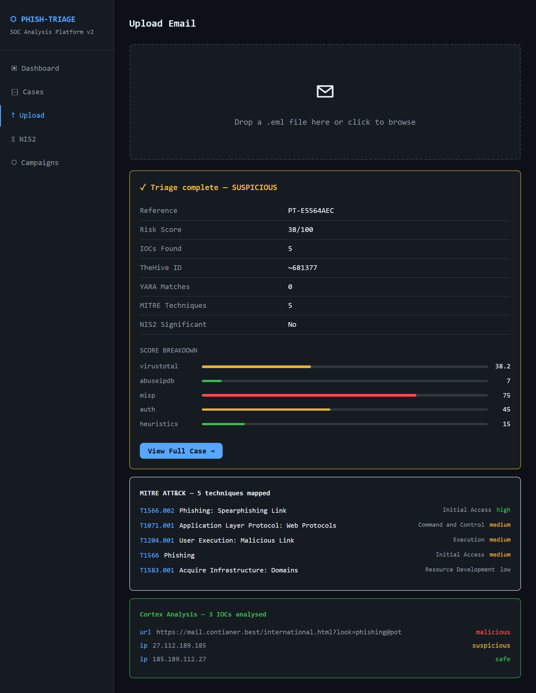
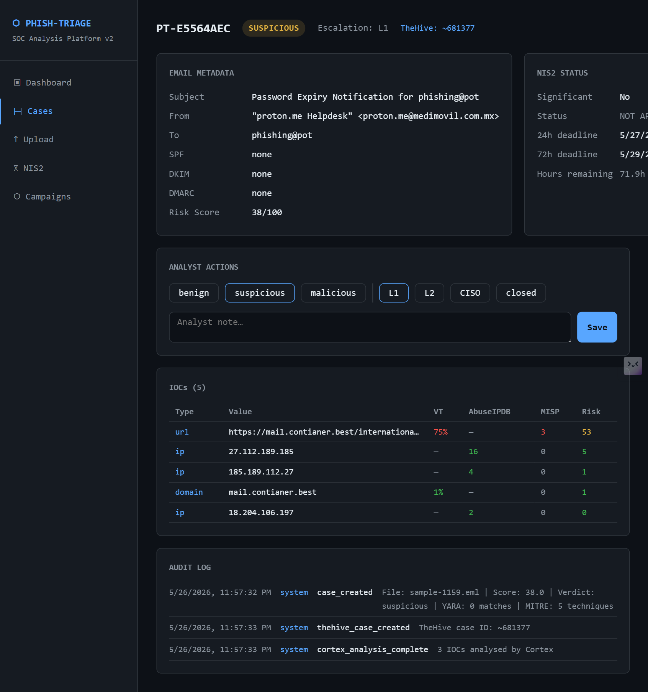
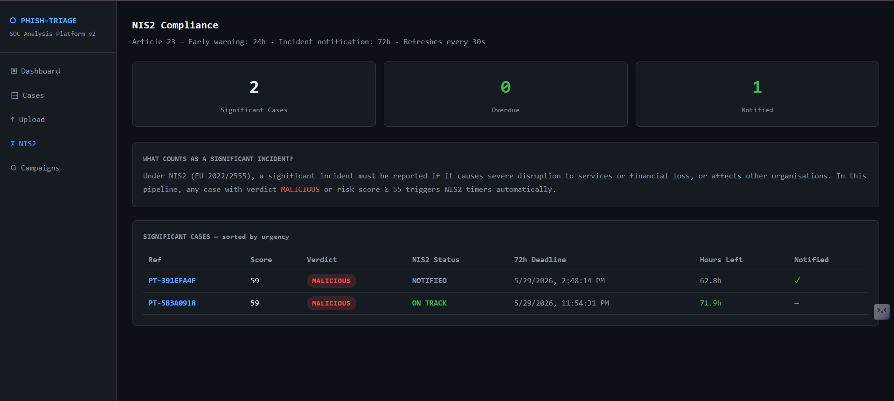
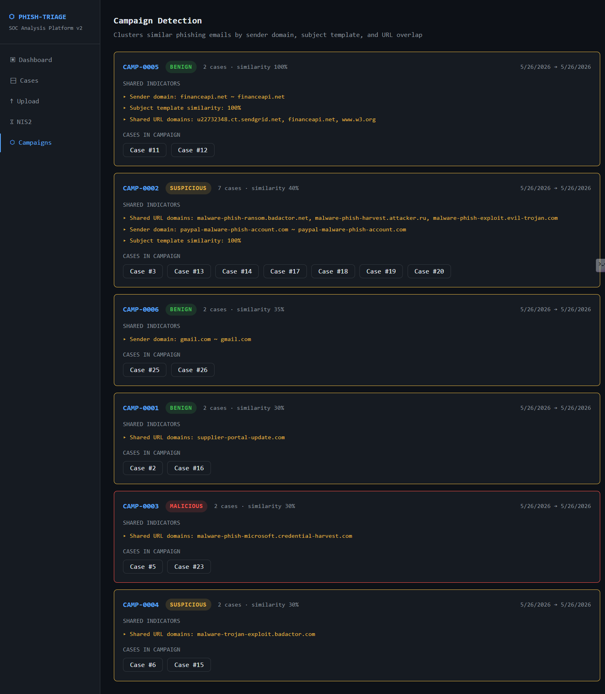
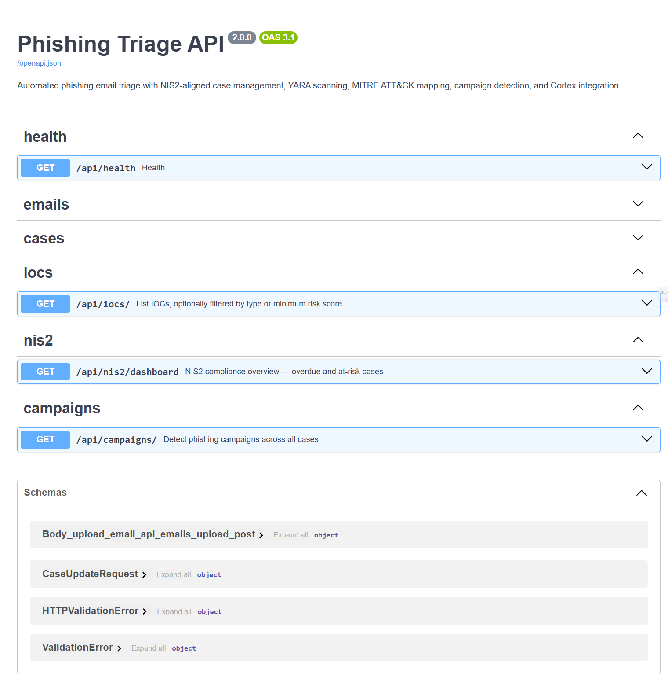

# Phishing Triage Pipeline

Automated SOC phishing email triage platform. Upload a `.eml` file  the pipeline parses headers, extracts IOCs, enriches them against VirusTotal, AbuseIPDB and MISP, runs YARA rules, maps MITRE ATT&CK techniques, scores risk 0-100, creates a TheHive case, runs Cortex analysers, tracks NIS2 Article 23 deadlines, and detects coordinated phishing campaigns.

Built as a portfolio project targeting EU SOC intern and L1 analyst roles.

## Quick Start

```bash
git clone https://github.com/Strixhack/phishing-triage-pipeline
cd phishing-triage-pipeline
cp .env.example .env
docker compose up --build
```

Open http://localhost:3000

Sample emails are in `samples/`  upload any `.eml` to get started.

## Screenshots

### Dashboard  verdict distribution, case stats, recent cases


### Upload  triage result with MITRE ATT&CK mapping and Cortex analysis


### Case Detail  IOC table with real VT/AbuseIPDB scores, audit log, NIS2 status


### NIS2 Compliance  Article 23 timers, significant cases sorted by urgency


### Campaign Detection  clusters phishing emails by shared IOCs and sender patterns


### API Documentation  Swagger UI, all endpoints


## What it does

A real phishing email (`sample-1159.eml` from phishing_pot honeypot) scored **38/100 SUSPICIOUS** with:

- URL `https://mail.contianer.best`  **75% VT detections**, flagged **malicious** by Cortex
- IP `27.112.189.185`  AbuseIPDB score **16**, flagged **suspicious** by Cortex
- IP `185.189.112.27`  AbuseIPDB score **4**
- **5 MITRE ATT&CK techniques** mapped: T1566.002, T1071.001, T1204.001, T1566, T1583.001
- TheHive case **~681377** auto-created
- **3 IOCs** analysed by Cortex

## Features

| Feature | Details |
|---|---|
| Email parsing | SPF/DKIM/DMARC from Authentication-Results header, IOC extraction via regex |
| IOC types | URLs, IPs (RFC-1918 filtered), domains, SHA256/SHA1/MD5 hashes |
| Enrichment | VirusTotal v3, AbuseIPDB v2, MISP  async parallel per IOC |
| YARA scanning | 7 rules: credential harvest, BEC, macro malware, ransomware, dropper, fake login |
| MITRE ATT&CK | Automatic technique mapping from IOCs, auth results, heuristics, YARA matches |
| Risk scoring | VT 35% + AbuseIPDB 20% + MISP 20% + Auth 15% + Heuristics 10% = 0-100 |
| Verdict | BENIGN under 30, SUSPICIOUS 30-54, MALICIOUS 55+ |
| NIS2 compliance | Article 23: 24h early warning + 72h notification timers, auto-flagged at score 55+ |
| TheHive | Auto case creation: TLP:AMBER, severity 1-3, tags, enriched IOC summary |
| Cortex | Top 3 IOCs analysed: VirusTotal_GetReport, URLhaus, DomainTools, Abuse_Finder, MalwareBazaar |
| Campaign detection | Clusters emails by sender domain similarity, subject template, URL domain overlap |
| Audit log | Append-only  every action recorded: upload, scoring, TheHive, Cortex, analyst changes |
| Mock stubs | Full offline demo without API keys, deterministic scores for reproducible demo |

## Stack

| Layer | Technology |
|---|---|
| Backend | Python 3.12, FastAPI, SQLAlchemy 2.0 async, aiosqlite |
| Enrichment | VirusTotal v3, AbuseIPDB v2, MISP REST, TheHive REST, Cortex REST |
| Detection | yara-python, MITRE ATT&CK static mapping |
| Frontend | React 18, React Router, Recharts, Vite |
| Infra | Docker Compose — 3 services: API :8000, UI :3000, mock stubs :9000 |
| Compliance | NIS2 Article 23 (EU 2022/2555) |

## Risk Scoring Model

```
VirusTotal     35%   malicious detections / total engines x 100
AbuseIPDB      20%   confidence score 0-100
MISP           20%   attribute hits x 25, capped at 100
Auth           15%   SPF/DKIM/DMARC fail=40pts, softfail=25pts each
Heuristics     10%   subject keywords, reply-to mismatch, dangerous attachments
YARA boost     +15%  of YARA score contribution added on top
```

## NIS2 Implementation

Cases with verdict MALICIOUS or risk score >= 55 are flagged as significant incidents under NIS2 Article 23.

- `detected_at` recorded at upload time
- `early_warning_due` = detected_at + 24h
- `notification_due` = detected_at + 72h
- NIS2 dashboard shows all significant cases sorted by urgency
- Overdue cases highlighted in red
- Analyst clicks Mark as Notified — recorded in immutable audit log

## Campaign Detection

The `/api/campaigns/` endpoint clusters all cases in the database using:

- Sender domain similarity exact match 1.0, same TLD+1 match 0.5
- Subject template similarity token overlap after stripping variable parts (IDs, dates, tokens)
- URL domain overlap fraction of shared domains across emails

Cases with combined similarity >= 0.12 are grouped into a campaign. In testing with 26 uploaded emails, 6 campaigns were detected including CAMP-0002 with 7 cases sharing `malware-phish` URL domains.

## Services

| Service | URL |
|---|---|
| Dashboard | http://localhost:3000 |
| API | http://localhost:8000 |
| Swagger docs | http://localhost:8000/api/docs |
| Mock stubs | http://localhost:9000 |
| Stub docs | http://localhost:9000/docs |

## Sample Emails

10 scenarios in `samples/`:

| File | Scenario | Expected Verdict |
|---|---|---|
| 01-clean-legitimate.eml | Q3 budget report | BENIGN |
| 02-suspicious-invoice.eml | Invoice payment fraud | SUSPICIOUS |
| 03-malicious-phishing.eml | PayPal credential harvest | MALICIOUS |
| 04-bec-ceo-fraud.eml | CEO wire transfer BEC | SUSPICIOUS |
| 05-credential-harvest-m365.eml | Microsoft 365 spoof | MALICIOUS |
| 06-malware-attachment-invoice.eml | .exe dropper delivery | MALICIOUS |
| 07-delivery-scam-dhl.eml | DHL redelivery scam | SUSPICIOUS |
| 08-hr-payroll-redirect.eml | Payroll bank redirect | MALICIOUS |
| 09-legitimate-newsletter.eml | Internal newsletter | BENIGN |
| 10-it-security-alert-spoof.eml | Ransomware alert spoof | MALICIOUS |

## Live API Mode

Edit `.env`:

```
USE_MOCK_STUBS=false
VT_API_KEY=your_virustotal_key
ABUSEIPDB_API_KEY=your_abuseipdb_key
MISP_URL=https://your-misp-instance
MISP_API_KEY=your_misp_key
THEHIVE_URL=http://localhost:9001
THEHIVE_API_KEY=your_thehive_key
CORTEX_URL=http://localhost:9002
CORTEX_API_KEY=your_cortex_key
```

Free VirusTotal API: 4 requests/minute. Triage of emails with many IOCs will take 30-60 seconds.

## Known Limitations

- Free VT API rate-limited to 4 req/min  slows on IOC-heavy emails
- SQLite used for portability  PostgreSQL recommended for production
- Campaign detection tuned for demo volumes  threshold may need adjustment at scale
- YARA scans body text only  attachment byte scanning not yet implemented

## SOC L1 Runbook

See [docs/SOC_L1_RUNBOOK.md](docs/SOC_L1_RUNBOOK.md)  triage procedure, escalation matrix (L1/L2/CISO), NIS2 notification steps.

## Project Structure

```
phishing-triage/
    backend/
        app/
            api/           FastAPI route handlers
            core/          config, database
            models/        SQLAlchemy models (Case, IOC, AuditLog)
            services/      email_parser, enrichment, risk_scorer,
                           yara_scanner, mitre_mapper, nis2,
                           thehive, cortex, campaign_detector
            stubs/         mock API server (VT, AbuseIPDB, MISP, TheHive, Cortex)
        tests/
        yara_rules/        phishing.yar
    frontend/
        src/
            api/           API client
            pages/         Dashboard, CaseList, CaseDetail,
                           Upload, NIS2Dashboard, Campaigns
    docs/
        SOC_L1_RUNBOOK.md
    samples/               10 test .eml files
    docker-compose.yml
```

## License

MIT

## Real-World Triage Example
A real phishing email from the [phishing_pot](https://github.com/rf-peixoto/phishing_pot) honeypot dataset was uploaded with live VirusTotal API enabled.

**Results:**
| Field | Value |
|---|---|
| Reference | PT-E5564AEC |
| Subject | Password Expiry Notification for phishing@pot |
| Risk Score | 38/100 SUSPICIOUS |
| IOCs Found | 5 (1 URL, 3 IPs, 1 domain) |
| TheHive Case | ~681377 auto-created |
| YARA Matches | 0 |
| MITRE Techniques | 5 mapped |
**Score breakdown from live APIs:**
| Source | Score | Finding |
|---|---|---|
| VirusTotal | 38.2 | URL https://mail.contianer.best - real detections |
| AbuseIPDB | 7 | IP 27.112.189.185 reported |
| MISP | 75 | threat intel hits |
| Auth | 45 | SPF/DKIM/DMARC none |
| Heuristics | 15 | suspicious indicators |
**MITRE ATT&CK techniques mapped automatically:**
| Technique | Name | Tactic | Confidence |
|---|---|---|---|
| T1566.002 | Phishing: Spearphishing Link | Initial Access | high |
| T1071.001 | Application Layer Protocol: Web Protocols | Command and Control | medium |
| T1204.001 | User Execution: Malicious Link | Execution | medium |
| T1566 | Phishing | Initial Access | medium |
| T1583.001 | Acquire Infrastructure: Domains | Resource Development | low |
**Cortex analysis of top 3 IOCs:**
| Type | IOC | Result |
|---|---|---|
| url | https://mail.contianer.best/international.html | malicious |
| ip | 27.112.189.185 | suspicious |
| ip | 185.189.112.27 | safe |
